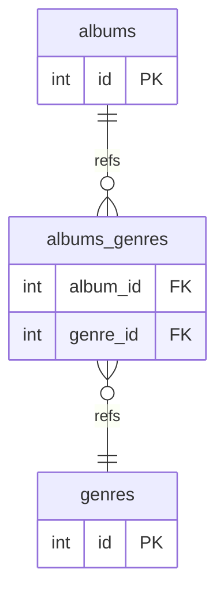

# EctoStarter

## Requirements
* Elixir: 1.16.1+
* Erlang: 26.2.2+
* Postgres: 14.10+

## Many-to-many relational tables and schemas



### 1. Generate a new migration to add the genres table
```bash
> mix ecto.gen.migration add_genres_table
* creating priv/repo/migrations/20240220225801_add_genres_table.exs
```

### 2. Modify the change function to create the genres table
```elixir
# priv/repo/migrations/20240220225801_add_genres_table.exs

defmodule EctoStarter.Repo.Migrations.AddGenresTable do
  use Ecto.Migration

  def change do
    create table(:genres) do
      add :name, :string, null: false
      add :wiki_tag, :string, null: true
      timestamps null: true
    end
    create index(:genres, :name, unique: true)
  end
end
```

Test to ensure your migration script is successful by running `> mix ecto.migrate`. Also test that it rollbacks as expected by running `> mix ecto.rollback`.

### 3. Generate a new migration to add the albums_genres table
```bash
> mix ecto.gen.migration add_albums_genres_table
* creating priv/repo/migrations/20240225152952_add_albums_genres_table.exs
```

### 4. Modify the change function to create the albums_genres table
```elixir
# priv/repo/migrations/20240225152952_add_albums_genres_table.exs

defmodule EctoStarter.Repo.Migrations.AddAlbumsGenresTable do
  use Ecto.Migration

  def change do
    create table(:albums_genres) do
      add :album_id, references(:albums)
      add :genre_id, references(:genres)
    end

    create index(:albums_genres, :album_id)
    create index(:albums_genres, :genre_id)
  end
end
```

Test to ensure your migration script is successful by running `> mix ecto.migrate`. Also test that it rollbacks as expected by running `> mix ecto.rollback`.

### 6. Add genre schema
```elixir
# lib/ecto_starter/genre.ex

defmodule EctoStarter.Genre do
  use Ecto.Schema
  alias EctoStarter.Album

  schema "genres" do
    field(:name)
    field(:wiki_tag)
    timestamps()

    many_to_many(:albums, Album, join_through: "albums_genres")
  end
end
```

### 7. Add album_genre schema
```elixir
# lib/ecto_starter/album_genre.ex

defmodule EctoStarter.AlbumGenre do
  use Ecto.Schema
  alias EctoStarter.{Album, Genre}

  schema "albums_genres" do
    belongs_to(:albums, Album)
    belongs_to(:genres, Genre)
  end
end
```

### 8. Update album schema
```elixir
# lib/ecto_starter/album.ex

defmodule EctoStarter.Album do
  use Ecto.Schema
  alias EctoStarter.{Artist, Genre}

  schema "albums" do
    field(:title, :string)
    timestamps()

    belongs_to(:artist, Artist)
    many_to_many(:genres, Genre, join_through: "albums_genres")
  end
end
```

### 9. Update seeds file
```elixir
# priv/repo/seeds.exs

alias EctoStarter.{Repo, Artist, Album, Genre}

jazz_genre = Repo.insert!(%Genre{ name: "jazz", wiki_tag: "Jazz" })
live_genre = Repo.insert!(%Genre{ name: "live", wiki_tag: "Concert" })

Repo.insert! %Artist{
  name: "Miles Davis",
  albums: [
    %Album{
      title: "Kind Of Blue",
      genres: [jazz_genre]
    },
    %Album{
      title: "Cookin' At The Plugged Nickel",
      genres: [jazz_genre, live_genre]
    }
  ]}

Repo.insert! %Artist{
  name: "Bill Evans",
  albums: [
    %Album{
      title: "You Must Believe In Spring",
      genres: [jazz_genre]
    },
    %Album{
      title: "Portrait In Jazz",
      genres: [jazz_genre]
    }
  ]}

Repo.insert! %Artist{
  name: "Bobby Hutcherson",
  albums: [
    %Album{title: "Live At Montreaux"}
  ]}


IO.puts ""
IO.puts "Success! Sample data has been added."
```

### 10. Run mix ecto.reset to reset your local database
```bash
> mix ecto.reset
The database for EctoStarter.Repo has been dropped
The database for EctoStarter.Repo has been created

10:50:26.276 [info] == Running 20240220021453 EctoStarter.Repo.Migrations.AddArtistsTable.change/0 forward

10:50:26.278 [info] create table artists

10:50:26.324 [info] create index artists_name_index

10:50:26.328 [info] == Migrated 20240220021453 in 0.0s

10:50:26.391 [info] == Running 20240220043106 EctoStarter.Repo.Migrations.AddAlbumsTable.change/0 forward

10:50:26.392 [info] create table albums

10:50:26.395 [info] create index albums_artist_id_index

10:50:26.397 [info] == Migrated 20240220043106 in 0.0s

10:50:26.400 [info] == Running 20240220225801 EctoStarter.Repo.Migrations.AddGenresTable.change/0 forward

10:50:26.400 [info] create table genres

10:50:26.408 [info] create index genres_name_index

10:50:26.410 [info] == Migrated 20240220225801 in 0.0s

10:50:26.416 [info] == Running 20240225152952 EctoStarter.Repo.Migrations.AddAlbumsGenresTable.change/0 forward

10:50:26.416 [info] create table albums_genres

10:50:26.419 [info] create index albums_genres_album_id_index

10:50:26.421 [info] create index albums_genres_genre_id_index

10:50:26.423 [info] == Migrated 20240225152952 in 0.0s

10:50:26.518 [debug] QUERY OK source="genres" db=41.8ms queue=1.2ms idle=20.7ms
INSERT INTO "genres" ("name","wiki_tag","inserted_at","updated_at") VALUES ($1,$2,$3,$4) RETURNING "id" ["jazz", "Jazz", ~N[2024-02-25 15:50:26], ~N[2024-02-25 15:50:26]]

10:50:26.523 [debug] QUERY OK source="genres" db=3.2ms queue=2.0ms idle=68.4ms
INSERT INTO "genres" ("name","wiki_tag","inserted_at","updated_at") VALUES ($1,$2,$3,$4) RETURNING "id" ["live", "Concert", ~N[2024-02-25 15:50:26], ~N[2024-02-25 15:50:26]]

10:50:26.525 [debug] QUERY OK db=1.4ms idle=72.2ms
begin []

10:50:26.528 [debug] QUERY OK source="artists" db=1.2ms
INSERT INTO "artists" ("name","inserted_at","updated_at") VALUES ($1,$2,$3) RETURNING "id" ["Miles Davis", ~N[2024-02-25 15:50:26], ~N[2024-02-25 15:50:26]]

10:50:26.535 [debug] QUERY OK source="albums" db=1.5ms
INSERT INTO "albums" ("title","artist_id","inserted_at","updated_at") VALUES ($1,$2,$3,$4) RETURNING "id" ["Kind Of Blue", 1, ~N[2024-02-25 15:50:26], ~N[2024-02-25 15:50:26]]

10:50:26.539 [debug] QUERY OK source="albums_genres" db=0.9ms
INSERT INTO "albums_genres" ("album_id","genre_id") VALUES ($1,$2) [1, 1]

10:50:26.543 [debug] QUERY OK source="albums" db=3.9ms
INSERT INTO "albums" ("title","artist_id","inserted_at","updated_at") VALUES ($1,$2,$3,$4) RETURNING "id" ["Cookin' At The Plugged Nickel", 1, ~N[2024-02-25 15:50:26], ~N[2024-02-25 15:50:26]]

10:50:26.544 [debug] QUERY OK source="albums_genres" db=0.4ms
INSERT INTO "albums_genres" ("album_id","genre_id") VALUES ($1,$2) [2, 1]

10:50:26.545 [debug] QUERY OK source="albums_genres" db=1.1ms
INSERT INTO "albums_genres" ("album_id","genre_id") VALUES ($1,$2) [2, 2]

10:50:26.547 [debug] QUERY OK db=1.7ms
commit []

10:50:26.548 [debug] QUERY OK db=0.4ms idle=95.2ms
begin []

10:50:26.550 [debug] QUERY OK source="artists" db=0.6ms
INSERT INTO "artists" ("name","inserted_at","updated_at") VALUES ($1,$2,$3) RETURNING "id" ["Bill Evans", ~N[2024-02-25 15:50:26], ~N[2024-02-25 15:50:26]]

10:50:26.553 [debug] QUERY OK source="albums" db=1.2ms
INSERT INTO "albums" ("title","artist_id","inserted_at","updated_at") VALUES ($1,$2,$3,$4) RETURNING "id" ["You Must Believe In Spring", 2, ~N[2024-02-25 15:50:26], ~N[2024-02-25 15:50:26]]

10:50:26.554 [debug] QUERY OK source="albums_genres" db=1.1ms
INSERT INTO "albums_genres" ("album_id","genre_id") VALUES ($1,$2) [3, 1]

10:50:26.555 [debug] QUERY OK source="albums" db=1.0ms
INSERT INTO "albums" ("title","artist_id","inserted_at","updated_at") VALUES ($1,$2,$3,$4) RETURNING "id" ["Portrait In Jazz", 2, ~N[2024-02-25 15:50:26], ~N[2024-02-25 15:50:26]]

10:50:26.556 [debug] QUERY OK source="albums_genres" db=0.7ms
INSERT INTO "albums_genres" ("album_id","genre_id") VALUES ($1,$2) [4, 1]

10:50:26.558 [debug] QUERY OK db=2.0ms
commit []

10:50:26.559 [debug] QUERY OK db=0.7ms idle=105.8ms
begin []

10:50:26.563 [debug] QUERY OK source="artists" db=1.9ms
INSERT INTO "artists" ("name","inserted_at","updated_at") VALUES ($1,$2,$3) RETURNING "id" ["Bobby Hutcherson", ~N[2024-02-25 15:50:26], ~N[2024-02-25 15:50:26]]

10:50:26.566 [debug] QUERY OK source="albums" db=2.4ms
INSERT INTO "albums" ("title","artist_id","inserted_at","updated_at") VALUES ($1,$2,$3,$4) RETURNING "id" ["Live At Montreaux", 3, ~N[2024-02-25 15:50:26], ~N[2024-02-25 15:50:26]]


10:50:26.567 [debug] QUERY OK db=0.4ms
commit []
Success! Sample data has been added.
```

### 11. Start IEx session and run a query on new tables
```elixir
> iex -S mix
Erlang/OTP 26 [erts-14.2.2] [source] [64-bit] [smp:4:4] [ds:4:4:10] [async-threads:1]

Interactive Elixir (1.16.1) - press Ctrl+C to exit (type h() ENTER for help)
iex(1)> Repo.all(from a in Artist, where: a.name == "Miles Davis", preload: [albums: :genres])

10:56:31.961 [debug] QUERY OK source="artists" db=0.8ms queue=2.5ms idle=1933.8ms
SELECT a0."id", a0."name", a0."birth_date", a0."death_date", a0."inserted_at", a0."updated_at" FROM "artists" AS a0 WHERE (a0."name" = 'Miles Davis') []

10:56:31.962 [debug] QUERY OK source="albums" db=0.3ms queue=0.7ms idle=1937.2ms
SELECT a0."id", a0."title", a0."inserted_at", a0."updated_at", a0."artist_id", a0."artist_id" FROM "albums" AS a0 WHERE (a0."artist_id" = $1) ORDER BY a0."artist_id" [1]

10:56:31.963 [debug] QUERY OK source="genres" db=1.0ms idle=1938.4ms
SELECT g0."id", g0."name", g0."wiki_tag", g0."inserted_at", g0."updated_at", a1."album_id"::bigint FROM "genres" AS g0 INNER JOIN "albums_genres" AS a1 ON g0."id" = a1."genre_id" WHERE (a1."album_id" = ANY($1)) ORDER BY a1."album_id"::bigint [[1, 2]]
[
  %EctoStarter.Artist{
    __meta__: #Ecto.Schema.Metadata<:loaded, "artists">,
    id: 1,
    name: "Miles Davis",
    birth_date: nil,
    death_date: nil,
    inserted_at: ~N[2024-02-25 15:50:26],
    updated_at: ~N[2024-02-25 15:50:26],
    albums: [
      %EctoStarter.Album{
        __meta__: #Ecto.Schema.Metadata<:loaded, "albums">,
        id: 1,
        title: "Kind Of Blue",
        inserted_at: ~N[2024-02-25 15:50:26],
        updated_at: ~N[2024-02-25 15:50:26],
        artist_id: 1,
        artist: #Ecto.Association.NotLoaded<association :artist is not loaded>,
        genres: [
          %EctoStarter.Genre{
            __meta__: #Ecto.Schema.Metadata<:loaded, "genres">,
            id: 1,
            name: "jazz",
            wiki_tag: "Jazz",
            inserted_at: ~N[2024-02-25 15:50:26],
            updated_at: ~N[2024-02-25 15:50:26],
            albums: #Ecto.Association.NotLoaded<association :albums is not loaded>
          }
        ]
      },
      %EctoStarter.Album{
        __meta__: #Ecto.Schema.Metadata<:loaded, "albums">,
        id: 2,
        title: "Cookin' At The Plugged Nickel",
        inserted_at: ~N[2024-02-25 15:50:26],
        updated_at: ~N[2024-02-25 15:50:26],
        artist_id: 1,
        artist: #Ecto.Association.NotLoaded<association :artist is not loaded>,
        genres: [
          %EctoStarter.Genre{
            __meta__: #Ecto.Schema.Metadata<:loaded, "genres">,
            id: 1,
            name: "jazz",
            wiki_tag: "Jazz",
            inserted_at: ~N[2024-02-25 15:50:26],
            updated_at: ~N[2024-02-25 15:50:26],
            albums: #Ecto.Association.NotLoaded<association :albums is not loaded>
          },
          %EctoStarter.Genre{
            __meta__: #Ecto.Schema.Metadata<:loaded, "genres">,
            id: 2,
            name: "live",
            wiki_tag: "Concert",
            inserted_at: ~N[2024-02-25 15:50:26],
            updated_at: ~N[2024-02-25 15:50:26],
            albums: #Ecto.Association.NotLoaded<association :albums is not loaded>
          }
        ]
      }
    ]
  }
]
```